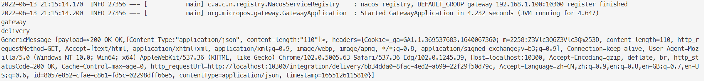

# aw08

> 此仓库版本为适用于此次作业的快照版本，原项目参见 [micro-pos](https://github.com/StardustDL/micro-pos)

在网关项目中实现集成，由于整个项目基于 WebFlux 构建，使用 spring-integration-webflux 完成 inbound 和 outbound。

1. 使用 `inboundChannelAdapter` 创建新的终结点 `/integration/delivery/{id}`
   1. 使用 `payloadExpression` 将路径参数存入消息的负载中
   2. 将消息放入信道 `deliveryRequestChannel`
2. 从信道 `deliveryRequestChannel` 读取消息
   1. 使用 `outboundGateway` 转发请求
   2. 从消息负载中读取路径参数，构造转发的目的 URL
   3. 收到响应后，使用 println 输出到标准输出（这里仅作功能实现正确的演示目的）

核心实现代码如下：

```java
@Component
class HttpInboundGateway {
    @Bean
    public IntegrationFlow inGate() {
        return IntegrationFlows
                .from(WebFlux.inboundChannelAdapter("/integration/delivery/{id}")
                        .requestMapping(m -> m.methods(HttpMethod.GET))
                        .payloadExpression("#pathVariables.id")
                        .statusCodeFunction(m -> HttpStatus.ACCEPTED))
                .channel("deliveryRequestChannel")
                .get();
    }
}

@Component
class HttpOutboundGateway {
    @Bean
    public IntegrationFlow outGate() {
        return IntegrationFlows.from("deliveryRequestChannel")
                .handle(WebFlux
                        .<String>outboundGateway(
                                m -> UriComponentsBuilder
                                        .fromUriString("http://localhost:10900/api/"
                                                + m.getPayload())
                                        .build()
                                        .toUri())
                        .httpMethod(HttpMethod.GET))
                .handle(System.out::println)
                .get();
    }
}
```

## 效果展示

访问 `/integration/delivery/xxxx` 自动转发到某个配送服务实例的对应终结点 `http://localhost:10900/api/xxxx`.



## 讨论

优点：

- 可以与现有服务集成，而不受对方服务编程语言，技术栈，运行环境等的限制
- 提供了多种多样的集成流，包括消息队列，文件系统，HTTP请求等，适用性广
- 允许声明式的集成流定义，配置灵活

但在本项目中，由于网关已将配送服务转发，使用集成实现代理网关的效果并不比专项专用的网关方便高效，在网关以外的场景，集成可能更有优势。

## Description

Run the project with `mvn spring-boot:run` and send request to `http://localhost:8080/check`. You should see an reponses in json format like the following.

```json
{
    "icon_url": "https://assets.chucknorris.host/img/avatar/chuck-norris.png",
    "id": "kswv7NIaTCaIIErlBzODaA",
    "url": "https://api.chucknorris.io/jokes/kswv7NIaTCaIIErlBzODaA",
    "value": "Chuck Norris's shadow weighs 250 pounds and can kick your ass ."
}
```

Try to understand the provided code which demonstrates spring integration between a spring boot application with an externel http service (https://api.chucknorris.io/jokes/random).

Please implement delivery as an standalone service (just like the random joke service). Refer the sample code to integrate your Micropos system with delivery service so that user can check delivery status on Miropos which actually forwards user request to delivery service on demand.


Consider the advantage by doing so and write it down in your readme file.